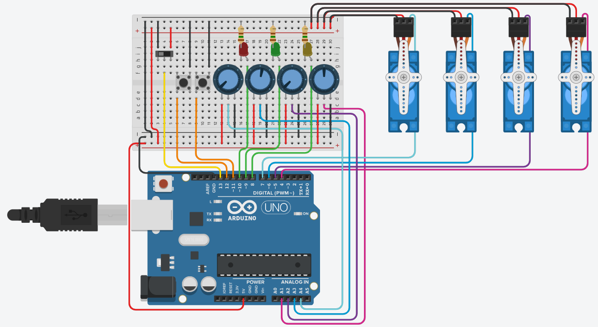

# ServoMotores
Projeto de gravação e reprodução de posições com quatro servomotores para uso industrial

Neste programa, apertando no botão GRAVADOR (indo para o estado 0), as posições escolhidas dos servoMotores pelos seus respectivos potenciometros serão gravadas na variável x, podendo serem gravadas até 50 posições; e o led amarelo acenderá.
Mudando a chave REPRODUTOR para o estado 1 (HIGH), as gravações feitas serão produzidas na ordem em que foram gravadas e o led verde será acionado.
Voltando a chave REPRODUTOR para o estado 0 (LOW), as gravações continuarão a partir da última produção e o led vermelho será acionado.
Apertando o botão SET, exclui-se todas as posições criadas e o led amarelo será acionado.

## Arquitetura

